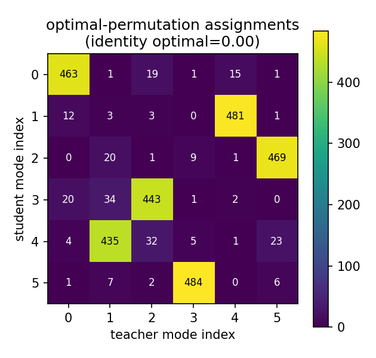
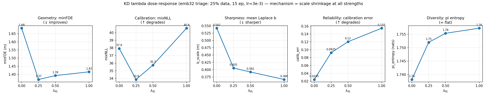

# Knowledge Distillation for Motion Prediction (HiVT) — Key Findings

> Working report. Companion to the detailed log in
> [`kd_emb32_kl_comparison.md`](kd_emb32_kl_comparison.md) (full tables, glossary,
> reproduction commands). This document is the curated key-findings summary.

---

## 1. Recap / thesis narrative

The thesis is on **motion prediction**, motivated by **hardware limitations**: large
models like HiVT-128 are accurate but expensive, so we ask how small a model can be
made while retaining its predictive quality. We follow the **knowledge-distillation
(KD)** path: take a pretrained **HiVT-128 teacher** and transfer its knowledge to a
much smaller **HiVT-32 student** (and, next, HiVT-16).

The arc of the work:

1. **Naive index-aligned KD did nothing** — because the teacher's and student's
   mixture modes do not correspond slot-for-slot (shown empirically in §3).
2. **A permutation-invariant KD loss (v1)** fixed the correspondence problem and
   **improved accuracy** (minADE/FDE/MR) — but by **discarding the teacher's
   uncertainty**, it made the student **over-confident** and **worsened
   calibration**.
3. **A distribution-matching KD loss (v2)** distils the teacher's *full predictive
   distribution* (not just its mode means), and **recovers calibration** while
   keeping the accuracy gain.

The remaining axis — central to the hardware motivation — is **efficiency vs.
accuracy/calibration vs. model size** (§8).

---

## 2. Setup

| | |
|---|---|
| Teacher | **HiVT-128** (pretrained author checkpoint), 2.56 M params |
| Student | **HiVT-32** (this work), 170 K params (**15× smaller**) |
| Next student | **HiVT-16**, 46 K params (**55× smaller**) |
| Data | Argoverse-1 motion forecasting, full val = 39,472 scenes |
| Recipe | `bs=128`, `lr=3e-3`, bf16, ~64 epochs (full data) |
| Teacher cache | `teacher_outputs/train_fix.h5` (verified-good) |

Metrics: geometry = oracle best-of-6 (`minADE`/`minFDE`/`minMR`); probability-aware
= `brier-minFDE` (official Argoverse-1 ranking metric); full-distribution =
`mixNLL`; calibration diagnostics = `b_scale` (predicted Laplace sharpness),
`calib_err`, coverage `cov_p*`, `pi_entropy`. (Full glossary in the companion doc.)

---

## 3. Why a permutation-invariant loss — the mode-correspondence diagnostic

HiVT trains its mixture modes with a **winner-takes-all** objective, which is
*symmetric under relabelling of the modes*. So which slot specialises to which
behaviour ("turn left", "keep straight", …) is **arbitrary per training run**. Two
independently trained models (HiVT-128 teacher, HiVT-32 student) therefore have **no
reason to share slot ordering** — and a naive index-aligned KD loss (compare
student-mode-k to teacher-mode-k) compares unrelated trajectories.

We tested this directly ([`KD/kd_mode_permutation_test.py`](../KD/kd_mode_permutation_test.py),
500 scenes):

| quantity | value | meaning |
|---|---:|---|
| identity (index-aligned) is optimal in | **0.0%** of scenes | slots never line up |
| greedy accidental alignment rate | 0.108 (chance = 0.167) | ≈ chance |
| mean pairing distance, identity | 5.165 m | index-aligned cost |
| mean pairing distance, optimal (Hungarian) | 1.817 m | best matching |
| identity / optimal cost ratio | **3.98×** (median 3.31×) | index-alignment is 4× worse |



**Reading the figure:** under optimal (Hungarian) matching, each student mode (row)
maps strongly to **exactly one** teacher mode (column) — a *stable* correspondence
exists across the dataset — but it is **not the diagonal** (student 1→teacher 4,
2→5, 3→2, 4→1, 5→3). Compare the greedy/accidental version
([`mode_perm_greedy_fde_n500.png`](../KD/diagnostics/mode_perm_greedy_fde_n500.png)),
which is diffuse.

**Conclusion:** mode slots do **not** correspond across the two models, so
index-aligned KD is ill-posed. The fix is a loss that is invariant to mode ordering.

---

## 4. The two KD losses ([`KD/kd_loss.py`](../KD/kd_loss.py))

Both losses score teacher targets under the **whole** student K-mode mixture
(`logsumexp` over student modes), so they are **permutation-invariant** — no
Hungarian matching needed, and student-K need not equal teacher-F. What differs is
*what is distilled*.

### v1 — mean-target distillation (`--kd_mode mean`)

Scores the teacher's mode **means** `μ_T` as point targets, weighted by teacher
confidence `π_T`; **discards the teacher scales**:

```
L_KD = − (1/HD) · Σ_f π_T(f) · log p_student( μ_T(f) )
```

Maximising density *at the mean points* is achieved by **shrinking the student's
Laplace scales** → the student becomes **over-confident**. Good best-of-K geometry,
degraded full-distribution calibration.

### v2 — distribution-matching distillation (`--kd_mode dist`)

Draws Monte-Carlo Laplace **samples** from each teacher mode (using the teacher
scales `b_T`) and scores those under the student mixture:

```
L_KD = − (1/HD) · Σ_f π_T(f) · E_{y ~ Laplace(μ_T_f, b_T_f)}[ log p_student(y) ]
```

The student must now cover the teacher's **spread**, so collapsing its scales no
longer minimises the loss — the teacher's uncertainty is transferred and calibration
is restored. **v2 reduces exactly to v1 in the zero-variance limit** (`b_T→0`); it is
the strict generalisation that adds the discarded scale information back in.

> ⚠️ λ is **not** directly comparable across v1 and v2: the loss magnitude differs at
> the same λ, so the same nominal λ is a different effective KD strength. Compare each
> loss at its own optimum, or as an explicit "drop-in swap at fixed λ" with that
> caveat stated.

---

## 5. KEY FINDING — v1 trades calibration for accuracy (full data)

Same KD harness/recipe, only `λ_kl` changes. Canonical full-data checkpoints
(`lkl0.0` ep46, `lkl0.5` ep62), `eval.py`.

| Metric | λ=0 (No KD) | v1 λ=0.5 (Mean) | Change | |
|---|---:|---:|---:|:--:|
| **minADE** | 0.7670 | 0.7264 | −5.3% | ✅ |
| **minFDE** | 1.2293 | 1.1211 | −8.8% | ✅ |
| **minMR** | 0.12895 | 0.11788 | −8.6% | ✅ |
| brier_minFDE (official) | 1.8878 | 1.7924 | −5.05% | ✅ |
| **mixNLL** | 28.739 | 34.658 | +20.6% | ❌ |
| **calib_err** | 0.0313 | 0.1570 | **5.0× worse** | ❌ |
| **b_scale** (sharpness) | 0.4356 | 0.3021 | −30.6% | (shrinkage) |
| **cov_p90** | 0.903 | 0.754 | over-confident | ❌ |

**The central finding:** at full convergence, v1 KD improves geometry by ~5–9% but
**degrades full-distribution calibration** — `mixNLL` +20.6%, `calib_err` 5×, and the
predicted 90% interval captures only **75%** of ground-truth points (vs 90% for
no-KD). The no-KD baseline is *already well-calibrated* (cov_p90 ≈ 0.90), so v1 KD
**trades calibration away to buy accuracy**. v2's job is to keep the accuracy and
recover the calibration.

> **Thesis statement:** *Mean-target mixture distillation improves geometric accuracy
> and the official Argoverse ranking metric (brier-minFDE) but degrades
> full-distribution calibration (mixNLL), because it transfers the teacher's mode
> locations and weights while discarding its predictive variance, producing
> overconfident student mixtures.*

---

## 6. KEY FINDING — the mechanism is scale shrinkage, not mode collapse

The over-confidence lives **entirely in the per-mode Laplace scales**, not in
mixture-weight collapse.

| Diagnostic | λ=0.0 | λ=0.5 | Verdict |
|---|---:|---:|---|
| **b_scale** (chosen mode) | 0.4356 | 0.3021 | ✅ −30.6% (smoking gun) |
| b_scale_all (all modes) | 0.4985 | 0.3387 | ✅ −32.1% |
| **calib_err** | 0.0313 | 0.1570 | ✅ 5.0× worse |
| pi_entropy (mode-weight) | 1.7398 | 1.7579 | ❌ ~equal — **no collapse** |

Reliability curve (empirical coverage vs nominal `p`) — under-covered at every level:

| nominal `p` | 0.10 | 0.30 | 0.50 | 0.70 | 0.90 |
|---|---:|---:|---:|---:|---:|
| λ=0.0 | 0.075 | 0.247 | 0.452 | 0.682 | 0.903 |
| λ=0.5 | 0.047 | 0.160 | 0.303 | 0.493 | 0.754 |

**Mode diversity (independent corroboration)** —
[`visualisation_other_tests/measure_mode_diversity.py`](../visualisation_other_tests/measure_mode_diversity.py),
all 39,472 val scenes, pairwise final-endpoint spread between the 6 modes:

| stat (m) | kl=0.0 | kl=0.5 |
|---|---:|---:|
| mean | 8.548 | 10.686 (+25%) |
| 90th pct | 21.694 | 29.511 (+36%) |

The KD student's modes are *more* spread apart, not collapsed — so neither the
mixture weights nor the mode geometry collapse. The over-confidence is purely the
per-mode scales: **"distil means, discard variance"** confirmed precisely.

---

## 7. v1 λ dose-response (triage)

Re-evaluated the four v1 triage checkpoints (25% data, 15 ep, lr=3e-3), each judged
on the full val set.



| λ | minFDE | minADE | mixNLL | b_scale | calib_err | π-entropy |
|---|---:|---:|---:|---:|---:|---:|
| 0.0 | 1.683 | 0.925 | 37.93 | 0.5420 | 0.0245 | 1.7382 |
| **0.25** | **1.369** | **0.823** | **33.86** | 0.4055 | 0.0925 | 1.7520 |
| 0.5 | 1.393 | 0.835 | 35.74 | 0.3919 | 0.1204 | 1.7554 |
| 1.0 | 1.416 | 0.844 | 40.59 | 0.3662 | 0.1547 | 1.7573 |

- **Scale shrinkage and calibration damage are monotone in λ** (b_scale ↓, calib_err
  ↑ at every dose) — confirming the mechanism across the whole λ axis.
- **Geometry is NOT monotone — it peaks at λ≈0.25.** A little KD captures essentially
  all the displacement gain; more only over-distills.
- **No mode collapse at any dose** (π-entropy flat / slightly rising).

> Caveat: on triage, `mixNLL` is U-shaped (min at λ=0.25) because the undertrained
> λ=0 baseline makes KD's geometry gain dominate; **on full data this sign flips**
> (λ=0.5 mixNLL worse than λ=0, §5). Trust the geometry-agnostic diagnostics
> (`b_scale`, `calib_err`, coverage) — those degrade monotonically regardless.

---

## 8. v2 (distribution-matching) — triage results

v2 **beats v1 and shifts the λ optimum upward.** Triage (25% data, 15 ep proxy):

| run | minFDE | minADE | minMR | calib_err |
|---|---:|---:|---:|---:|
| v1 best (kl=0.25) | 1.360 | 0.842 | 0.153 | ~0.09 |
| **v2 kl=0.5** | 1.287 | **0.805** | 0.142 | **~0.023** |
| **v2 kl=1.0** | **1.279** | 0.805 | **0.135** | ~0.025 |

- Both v2 operating points **beat every v1 run on accuracy** while keeping
  `calib_err` near the well-calibrated no-KD baseline (~0.024) — i.e. v2 recovers
  the calibration v1 sacrificed.
- Between v2 kl=0.5 and kl=1.0: kl=1.0 is marginally sharper on accuracy
  (minMR/minFDE), kl=0.5 is slightly better calibrated; the accuracy gap is within
  seed noise. (kl=0.75 not worth testing — flat region.)

**Full-data v2 confirmation is in progress** (`KD/run_full_v2.sh`, kl=0.5, 64 ep) to
verify v2 keeps v1's accuracy *and* recovers baseline calibration at full scale.

### Teacher gold-standard (the v2 calibration target)

| (full data) | b_scale | calib_err | cov@p90 | mixNLL |
|---|---:|---:|---:|---:|
| student kl=0.0 (well-cal) | 0.436 | 0.031 | 0.903 | 28.74 |
| student kl=0.5 (v1 KD) | 0.302 | 0.157 | 0.754 | 34.66 |
| **teacher HiVT-128** | 0.358 | 0.047 | 0.894 | **21.05** |

The teacher is *sharper* than the well-calibrated student (b 0.358 < 0.436) yet stays
calibrated — because its modes are *accurate enough to earn* small scales. The v1
student over-shot *below* the teacher (b 0.302). So "match the teacher's b" is **not**
the right v2 target: the less-accurate student needs a *larger* b than the teacher to
be calibrated. **Pre-registered v2 expectation: b ↑ toward the teacher, calib_err ↓
toward ~0.05 — partial, not necessarily full, recovery** (mixNLL 21.05 is the
teacher's ceiling; no emb32 student will reach it).

---

## 9. Efficiency axis (hardware motivation)

[`KD/profile_efficiency.py`](../KD/profile_efficiency.py). Parameter counts
(architecture-determined, exact):

| model | embed | params | vs teacher |
|---|---:|---:|---:|
| teacher-128 | 128 | 2,559,993 | 100% (1×) |
| **student-32** | 32 | 170,073 | **6.6% (15× smaller)** |
| **student-16** | 16 | 45,929 | **1.8% (55× smaller)** |

**Accuracy recovered at 6.6% of the parameters:** v1 KD narrows the
HiVT-32→HiVT-64 minFDE gap by ~38% at zero inference cost; KD kl=0.5 beats the
original standalone HiVT-32 (minFDE −4.8%).

> ⏳ **Latency + peak-memory pending a clean measurement** (deferred until the GPU is
> free — measuring during the v2 training run gives contended, unusable numbers; a
> first contended CPU pass already showed an impossible row). Param counts are the
> reliable cost numbers for now.

---

## 10. Status & next steps

**Done / confirmed:**
- Permutation-invariance is empirically justified (§3).
- v1 KD: accuracy↑, calibration↓ via scale shrinkage — quantified at full data (§5–6).
- v2 (triage): beats v1 *and* recovers calibration (§8).
- Param efficiency: 15×/55× smaller (§9).

**In progress / next:**
1. **v2 full-data run** (kl=0.5, running) — confirm calibration recovery at scale.
2. **HiVT-16 student** — does the KD benefit *grow* as the student shrinks? (Re-triage
   LR first; keep kl=0 and kl=0.5 arms.) This is the strongest remaining contribution.
3. **Efficiency latency/memory** — clean GPU + CPU measurement for the cost frontier.
4. **Seeding** — 2–3 seeds on the *final* chosen config only (not the whole sweep) to
   make the headline deltas defensible.

**Open question for the supervisor:** is this scope (v2 full confirmation + HiVT-16
transfer + efficiency frontier + seeding) the right 2-week plan, and is there a
defined success metric (pure accuracy vs. calibrated uncertainty) to optimise toward?

---

## Figure / artifact index

| artifact | what it shows |
|---|---|
| [`KD/diagnostics/mode_perm_optimal_fde_n500.png`](../KD/diagnostics/mode_perm_optimal_fde_n500.png) | Hungarian mode matching — stable but non-identity correspondence (§3) |
| [`KD/diagnostics/mode_perm_greedy_fde_n500.png`](../KD/diagnostics/mode_perm_greedy_fde_n500.png) | greedy/accidental matching — diffuse (§3) |
| [`docs/figures/kd_lambda_sweep.png`](figures/kd_lambda_sweep.png) | v1 λ dose-response, 5 panels (§7) |
| [`kd_emb32_kl_comparison.md`](kd_emb32_kl_comparison.md) | full tables, glossary, reproduction commands |
| W&B: groups `full-emb32-distv2` (v2 full), v1/baseline full runs, triage λ/LR sweeps | training curves |